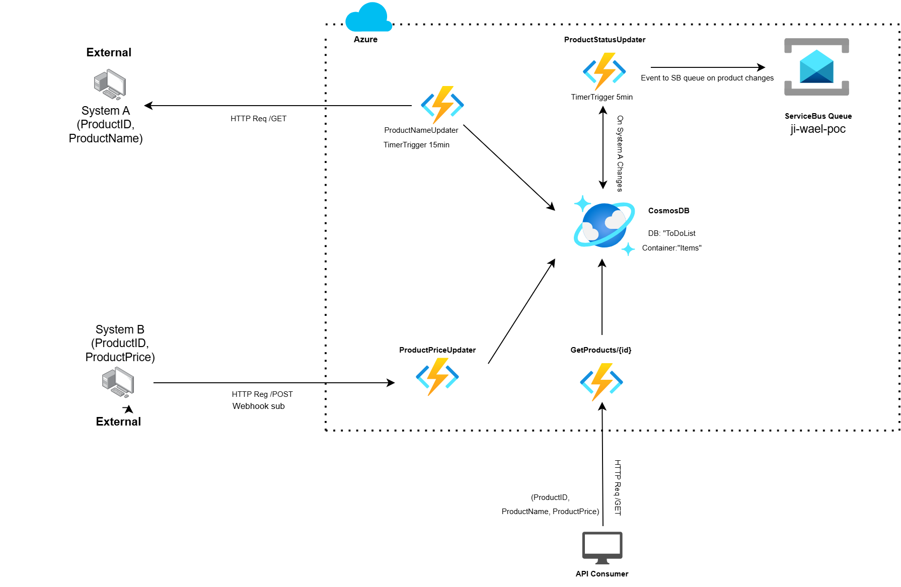
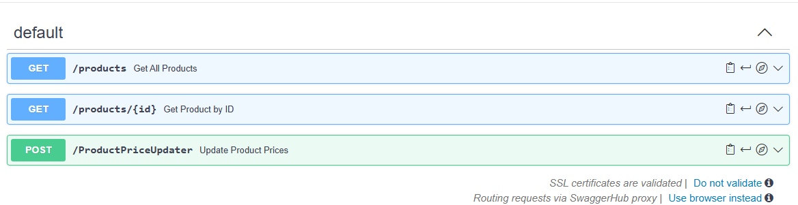
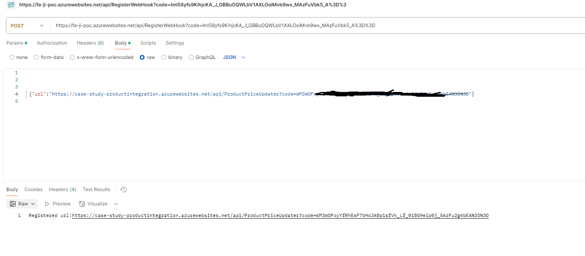

# Product System Integration

## Overview

This case study is about connecting two systems: one manages product names and IDs, the other manages product prices. It uses .Net to keep the data updated, stores it in Cosmos DB, and provides a quick API to access it. Extra features include handling new data fields and sending updates using Azure Service Bus.

### Architecture and Design

This solution integrates multiple Azure services (Azure Functions, Cosmos DB, and Service Bus) and external systems. It automates:

- Data fetching and merging from external systems.
- Database updates (product details and prices).
- Event notification for significant changes (e.g., weight updates).
- Scheduled maintenance tasks like weekly cache updates.

#### System A and System B work together to provide an API for product details (name, ID, and price):

- System A gives product names and IDs.
- System B gives product prices and notifies about price changes.

Azure Functions handle the data:

- **CosmosDB** is a data foundation and stores product details, prices and product statuses (if a product is New, Updated or Sent to the queue).
- **ProductNameUpdater** updates product names/IDs every 15 minutes from System A. As well as checking for new products and any logging changes.
- **ProductPriceUpdater** updates product prices whenever System B sends a price change via a webhook streamer.
- **ProductStatusUpdater** checks for any products with a status of "Updated" or "New" every 5 minutes. It sends these updates to a queue and then marks the products as "Sent" in Cosmos DB.
- **GetProducts API** allows users to fetch product details by ID or list of all products. It should be able to respond in less than 800ms in 10req/s load. Data is always fresh (updated within 15 minutes). The system is scalable and handles changes in real time.
- **Azure Service Bus queue** (ji-wael-poc) receives events like product updates for other systems to process.



---

## Code Walkthrough

### Helper Classes

#### CosmosDbHelper
- **Purpose**: Interacts with Azure Cosmos DB.
- **Key Function**: `GetContainer` - Returns a container for database operations.

#### HttpClientHelper
- **Purpose**: Handles HTTP requests to external systems.
- **Key Functions**: 
  - `GetDataFromSystemA` - Fetches product data.
  - `GetDataFromSystemB` - Fetches pricing data.

#### ServiceBusHelper
- **Purpose**: Sends messages to Azure Service Bus.
- **Key Function**: `SendEventToServiceBusAsync` - Sends product update events.

---

### ProductPriceUpdater
- **Purpose**: Represents a product's price update (used for event notifications as a webhook registration abon request). 
- **Properties**: `ProductId`, `ProductPrice`.

---

### ProductNameUpdater
- **Purpose**: Retrieves product data and ensures it’s up-to-date in Cosmos DB. It either updates existing products or inserts new ones, logging each step.
- **Trigger**: Timer (every 15 minutes).

---

### ProductStatusUpdater
- **Purpose**: Checks for updated or new products every 5 minutes and sends updates to a queue. Marks products as "Sent" in Cosmos DB.
- **Trigger**: Timer (every 5 minutes).

---

### GetProducts
- **Purpose**: Retrieves product information from Cosmos DB, either all products or a specific product by ID.
- **Trigger**: HTTP GET request.

---

### OpenAPI Specification

```yaml
openapi: 3.0.1
info:
  title: Product API
  description: API for managing product data and updating product prices in Cosmos DB.
  version: 1.0.0
paths:
  /products:
    get:
      summary: Get All Products
      description: Retrieve all products from the external API endpoint.
      operationId: getAllProducts
      parameters: []
      responses:
        '200':
          description: Successful response with product(s).
          content:
            application/json:
              schema:
                type: array
                items:
                  type: object
                  properties:
                    productId:
                      type: string
                      example: "abj3"
                    productName:
                      type: string
                      example: "Welding Rod 40stk"
                    productPrice:
                      type: number
                      example: 50
        '500':
          description: Internal server error.
      externalDocs:
        description: External API Documentation
        url: https://case-study-productintegration.azurewebsites.net/api/products?code={APi_Key}

  /products/{id}:
    get:
      summary: Get Product by ID
      description: Retrieve a specific product by ID from Cosmos DB.
      operationId: getProductById
      parameters:
        - name: id
          in: path
          description: The ID of the product to retrieve.
          required: true
          schema:
            type: string
      responses:
        '200':
          description: Successful response with product.
          content:
            application/json:
              schema:
                type: object
                properties:
                  productId:
                    type: string
                    example: "abj3"
                  productName:
                    type: string
                    example: "Welding Rod 40stk"
                  productPrice:
                    type: number
                    example: 50
        '404':
          description: Product not found.
        '500':
          description: Internal server error.
      externalDocs:
        description: External API Documentation
        url: https://case-study-productintegration.azurewebsites.net/api/products/abc2?code={APi_Key}

  /ProductPriceUpdater:
    post:
      summary: Update Product Prices
      description: Update the prices of multiple products in Cosmos DB.
      operationId: updateProductPrices
      requestBody:
        description: A list of product price updates.
        required: true
        content:
          application/json:
            schema:
              type: array
              items:
                type: object
                properties:
                  ProductId:
                    type: string
                    example: '12345'
                  ProductPrice:
                    type: number
                    example: 19.99
                required:
                  - ProductId
                  - ProductPrice
      responses:
        '200':
          description: Product prices updated successfully.
        '400':
          description: Invalid request body.
        '500':
          description: Internal server error.
      externalDocs:
        description: External API Documentation
        url: https://case-study-productintegration.azurewebsites.net/api/ProductPriceUpdater?code={APi_Key}

components: {}
servers:
  - description: SwaggerHub API Auto Mocking
    url: https://virtserver.swaggerhub.com/WAELENFO/ProductIntegration/1.0.0
```

## Open API Creation on Swagger:




---

## Price updater API registration to webhook:



---
